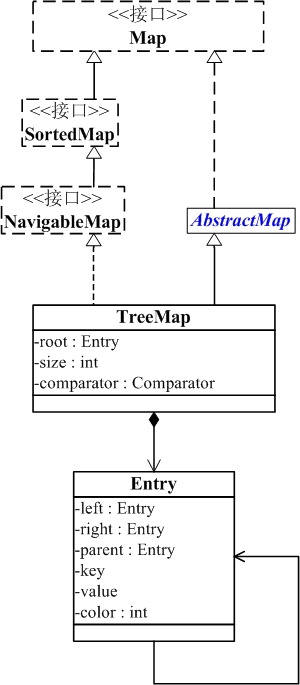

[TOC]

# Map实现类

## HashMap


`HashMap` 是一个散列表，它存储的内容是键值对(key-value)映射。

+ `HashMap`继承于`AbstractMap`类，实现了`Map`接口。`Map`是"key-value键值对"接口，`AbstractMap`实现了"键值对"的通用函数接口。 
+ `HashMap` 的实现不是同步的，这意味着它不是线程安全的。**它的`key`、`value`都可以为`null`。**此外**，`HashMap`中的映射不是有序的。**
+ 当单向链表长度超过8个时，会转为红黑树结构，当红黑树节点个数少于6个则会退化为单向链表。
+ `HahsMap`要求插入的键唯一，因此需要被持有对象重写`equals`、`hashCode`方法。


### 数据结构

**` HashMap`是基于哈希表、红黑树算法以数组+链表的实现的映射容器。其内部结点`Node<K,V>`是一个实现了`Map.Entry<K,V>`的键值对，`TreeNode`是组成红黑树、单向链表的结点。`HashMap`要求键唯一，值不用唯一，为了实现哈希算法还需要被持有对象重写`equals`、`hashCode`方法。** 

由于链表重构为红黑树，因此查询操作复杂度为$O(logN)$。 

 数组的查询时间复杂度是$O(1)$，所以`HashMap`理想时间复杂度是$O(1)$；如果所有数据都在同一个下标位置， 即N个数据组成链表，时间复杂度为$O(N)$， 所以`HashMap`的最差时间复杂度为$O(N)$。如果链表达到8个元素时重构为红黑树，而红黑树的查询时间复杂度为$O(logN)$, 所以这时`HashMap`的时间复杂度为$O(logN)​$。

[红黑树详细分析](http://www.tianxiaobo.com/2018/01/11/%E7%BA%A2%E9%BB%91%E6%A0%91%E8%AF%A6%E7%BB%86%E5%88%86%E6%9E%90/) 


### 构造函数

```java
//构造一个默认HashMap
public HashMap() {
    this.loadFactor = DEFAULT_LOAD_FACTOR; // all other fields defaulted
}

//指定初始容量
public HashMap(int initialCapacity) {
    this(initialCapacity, DEFAULT_LOAD_FACTOR);
}

//制定初始容量和负载因子
public HashMap(int initialCapacity, float loadFactor) {
    if (initialCapacity < 0)
        throw new IllegalArgumentException("Illegal initial capacity: " +
                                           initialCapacity);
    if (initialCapacity > MAXIMUM_CAPACITY)
        initialCapacity = MAXIMUM_CAPACITY;
    if (loadFactor <= 0 || Float.isNaN(loadFactor))
        throw new IllegalArgumentException("Illegal load factor: " +
                                           loadFactor);
    this.loadFactor = loadFactor;
    this.threshold = tableSizeFor(initialCapacity);//确保初始化容量是2的整数倍
}

//用另一个Map初始化
public HashMap(Map<? extends K, ? extends V> m) {
    this.loadFactor = DEFAULT_LOAD_FACTOR;
    putMapEntries(m, false);
}
```

`initialCapacity`：初始容量是指在哈希表里的桶总数， 一般在创建HashMap实例时设置初始容量。

​	HashMap的默认初始容量是16个， 而且容量只能是2的幂。  每次扩容时都是变成原来的2倍。

`loadFactor`：负载因子是指哈希表在多满时扩容的百分比比例。当哈希表的数据个数超过负载因子和当前容量的乘积时， 哈希表要再做一次哈希（重建内部数据结构）， 哈希表每次扩容为原来的2倍。

调节构造方法的参数`loadFactor(>0)`默认为0.75（平衡了时间和空间复杂度），会影响`HashMap`的时空复杂度： 调低`loadFactor`用空间换时间效率，升高`loadFactor`拿时间换空间。 这里说的时间复杂度是和查找，插入相关的。 

**如果有很多值要存储到HashMap实例中， 在创建HashMap实例时要设置足够大的初始容量， 避免自动扩容时rehash。** 如果很多关键字的哈希值相同， 会降低哈希表的性能。 为了降低这个影响， 当关键字支持`java.lang.Comparable`时， 可以对关键字做次排序以降低影响。

**调低`loadFactor`会降低遍历的性能。**

### HashMap的主要方法

HashMap主要实现了<a href="# Map接口主要方法">Map接口主要方法</a>的方法。

部分方法会返回Map.Entry对象的容器，可以根据<a href="# Map.Entry接口主要方法">Map.Entry接口的方法</a>对其操作。

## TreeMap



+ `TreeMap` 是一个**有序的key-value容器**，它是通过红黑树实现的。
+ `TreeMap` **继承于AbstractMap**，所以它是一个`Map`，即一个key-value集合。
+ `TreeMap` 实现了`NavigableMap`接口，意味着它**支持一系列的导航方法。**比如返回有序的`key`集合，匹配最接近的键值对。
+ `TreeMap` 实现了`Cloneable`接口，意味着**它能被克隆**。 
+ `TreeMap` 实现了`java.io.Serializable`接口，意味着**它支持序列化**。
+ `TreeMap`不能直接通过迭代器`Iterator`遍历。
+ `TreeMap`可以令值为`null`，键是否可以为`null`：若没有提供比较器由`compareTo`方法决定，不然由`compare`方法决定。
+ 

### TreeSet的数据结构

`TreeMap`基于**红黑树（Red-Black tree）实现**。该映射根据**其键的自然顺序进行排序（要求被持有对象实现`Comparable`接口）**，或者根据**创建映射时提供的 `Comparator` 进行排序**，具体取决于使用的构造方法。 


根据红黑树的性质TreeMap查询、更新的时间复杂度为$O(log(N))$。

红黑树参考资料

### 构造函数

不提供比较器`TreeSet`会根据键的自然顺序进行排序，且不允许键。

```java
//默认构造函数
public TreeMap() {
    comparator = null;
}
//提供比较器
public TreeMap(Comparator<? super K> comparator) {
    this.comparator = comparator;
}
//提供Map对象：将m中的键值对逐个添加到TreeMap中
public TreeMap(Map<? extends K, ? extends V> m) {
    comparator = null;
    putAll(m);
}
//提供SorterMap对象，隐含提供比较器
public TreeMap(SortedMap<K, ? extends V> m) {
    comparator = m.comparator();
    try {
        buildFromSorted(m.size(), m.entrySet().iterator(), null, null);
    } catch (java.io.IOException cannotHappen) {
    } catch (ClassNotFoundException cannotHappen) {
    }
}
```

### TreeMap的主要方法

根据类图可知TreeMap实现了

<a href="# Map接口主要方法">Map接口主要方法</a>

<a href="# SortedMap接口主要方法">SortedMap接口主要方法</a>

<a href="# NavigableMap接口主要方法">NavigableMap接口主要方法</a>

<a href="# Map.Entry接口主要方法">Map.Entry接口主要方法</a>

## Map的遍历方式

`Map`并没有实现`Iterable`接口，因此不能直接遍历，但是Map接口提供了 `Collection<V> values()` 、`Set<Map.Entry<K,V>>` `entrySet()` 、`Set<K> keySet()`返回相应的容器，而这些容器都支持迭代器的遍历。

接下来看一下怎么通过这些方法遍历`Map`。

### 简单遍历键或值

如果只需要`Map`的key或者value，用`Map`的`keySet()`或`values()`方法无疑是最方便的

```java
  // KeySet 获取key
  public void testKeySet() {
    for (Integer key : map.keySet()) {
      System.out.println(key);
    }
  }
  // values 获取value
  public void testValues() {
    for (Integer value : map.values()) {
      System.out.println(value);
    }
  }
```

### 同时获取键和值—不推荐

如果需要同时获取key和value，可以先获取key,然后再通过`Map`的`get(key)`获取value

需要说明的是，该方法不是最优选择，一般不推荐使用，因为这相当于两重循环去遍历`Map`。

```java
// keySet get(key) 获取key and value
  public void testKeySetAndGetKey() {
    for (Integer key : map.keySet()) {
      System.out.println(key + ":" + map.get(key));
    }
  }
```

### 遍历键值对

通过对`entrySet()`获得key-value集合在对其遍历，也可以同时拿到key和value，一般情况下，性能上要优于上一种,这一种也是最常用的遍历方法。

```JAVA
 // entrySet 获取key and value
  public void testEntry() {
    for (Map.Entry<Integer, Integer> entry : map.entrySet()) {
      System.out.println(entry.getKey() + ":" + entry.getValue());
    }
  }
```

### 使用迭代器Iterator

对于上面的几种`foreach`都可以用`Iterator`代替，其实`foreach`在java5中才被支持，`foreach`的写法看起来更简洁

**但`Iterator`也有其优势：在用`foreach`遍历`Map`时，如果改变其大小，会报错，但如果只是删除元素，可以使用`Iterator`的`remove`方法删除元素**

```java
 // Iterator entrySet 获取key and value
  public void testIterator() {
    Iterator<Map.Entry<Integer, Integer>> it = map.entrySet().iterator();
    while (it.hasNext()) {
      Map.Entry<Integer, Integer> entry = it.next();
      System.out.println(entry.getKey() + ":" + entry.getValue());
      // it.remove(); 删除元素
    }
  }
```

### 使用Lambda表达式

`Map`提供了一个`forEach(BiConsumer<? super K,? super V> action)`  对此`Map`中的每项（键值对）执行给定的操作，直到所有项都被处理或操作引发异常。  `BiConsumer`是一个函数式接口，因此我们可以通过lambda表达式简化编程。

Lambda表达式语法看起来更简洁，可以同时拿到key和value，不过，经测试，性能低于`entrySet`,所以更推荐用`entrySet`的方式

```java
 // Lambda 获取key and value
  public void testLambda() {
    map.forEach((key, value) -> {
      System.out.println(key + ":" + value);
    });
  }
```


## Map接口主要方法

```java
V get(Object key) 					   //返回指定键所映射的值；如果此映射不包含该键的映射关系，则返回 null。
V put(K key, V value) 					//将指定的值与此Map中的指定键关联（可选操作）。并返回原来键，若没有返回null 
V remove(Object key) 					//如果存在一个键key的映射关系，则将其从此Map中移除（可选操作）。 
V replace(K key, V value) 				//只有当指定键映射到某个值时，才能替换指定键的条目。 
boolean containsKey(Object key)  		//如果此Map包含指定键的映射关系，则返回 true。 
boolean containsValue(Object value)  	//如果此Map将一个或多个键映射到指定值，则返回 true。 
 int size() 						   //返回此Map中的Map.Entry数。
 void clear() 						   //从此Map中移除所有映射关系（可选操作）。 
 boolean isEmpty() 					    //如果此Map未包含Map.Entry，则返回 true。
 boolean equals(Object o) 			     //比较指定的对象与此映射是否相等。 
 Collection<V> values()  				//返回此Map中包含的值的 Collection 对象。
 Set<Map.Entry<K,V>> entrySet() 		 //返回此Map中包含的映射关系的 Set 对象。 
 Set<K> keySet() 					    //返回此Map中包含的键的 Set 对象。 
void forEach(BiConsumer<? super K,? super V> action) //对此Map中的每项（键值对）执行给定的操作，直到所有项都被处理或操作引发异常。 ——常用来遍历
```

## SortedMap接口主要方法

```java
 Comparator<? super K>	comparator()		  	//返回当前SortedMap的比较器。如果当前SortedMap按键的自然顺序排序，则返回null。
 K	firstKey() 								//返回SortedMap的第一个键
 K	lastKey()								//返回SortedMap的最后一个键
 SortedMap<K, V>	headMap(K endKey)		  //返回当前SortedMap中键小于endKey的子集
 SortedMap<K, V>	subMap(K startKey, K endKey)//返回当前SortedMap中键属于[startKey,endKey)的子集
 SortedMap<K, V>	tailMap(K startKey)		   ////返回当前SortedMap中键大于等于startKey的子集
```

## NavigableMap接口主要方法

提供导航、搜索的相关方法

```java
Map.Entry<K, V>	ceilingEntry(K key)//返回一个Map.Entry，它与大于等于给定键的最小键关联；如果不存在这样的键，则返回 null。
    
K	ceilingKey(K key)//返回大于等于给定键的最小键；如果不存在这样的键，则返回 null。   
    
Map.Entry<K, V>	firstEntry()//返回一个与此Map中的最小键关联的Map.Entry；如果映射为空，则返回 null。
    
Map.Entry<K, V>	floorEntry(K key)//返回一个Map.Entry，它与小于等于给定键的最大键关联；如果不存在这样的键，则返回 null。

K	floorKey(K key)//返回小于等于给定键的最大键；如果不存在这样的键，则返回 null。 
    
Map.Entry<K, V>	higherEntry(K key)//返回一个Map.Entry，它与严格大于给定键的最小键关联；如果不存在这样的键，则返回 null。

K	higherKey(K key)//返回严格大于给定键的最小键；如果不存在这样的键，则返回 null。
    
Map.Entry<K, V>	lastEntry()// 返回与此Map中的最大键关联的Map.Entry；如果映射为空，则返回 null。
    
Map.Entry<K, V>	lowerEntry(K key)//返回一个Map.Entry，它与严格小于给定键的最大键关联；如果不存在这样的键，则返回 null。
    
Map.Entry<K, V>	pollFirstEntry()//移除并返回与此Map中的最大键关联的Map.Entry；如果映射为空，则返回 null。
    
Map.Entry<K, V>	pollLastEntry()//移除并返回与此Map中的最大键关联的Map.Entry；如果映射为空，则返回 null。 
      
K	lowerKey(K key)//返回严格小于给定键的最大键；如果不存在这样的键，则返回 null。
```

**说明**：

`NavigableMap`除了继承`SortedMap`的特性外，它的提供的常用功能可以分为2类：

- **提供搜索键-值对的方法。**
       `lowerEntry`、`floorEntry`、`ceilingEntry` 和 `higherEntry` 方法，它们分别返回与小于、小于等于、大于等于、大于给定键的键关联的 `Map.Entry` 对象。
       `firstEntry`、`pollFirstEntry`、`lastEntry` 和 `pollLastEntry` 方法，它们返回和/或移除最小和最大的`Map.Entry`（如果存在），否则返回 `null`。
- **提供搜索键的方法**。这个和第1类比较类似
       `lowerKey`、`floorKey`、`ceilingKey` 和 `higherKey` 方法，它们分别返回与小于、小于等于、大于等于、大于给定键的键。

## Map.Entry接口主要方法

```java
boolean  equals(Object object)			//如果obj是一个Map.Entry返回true
K  getKey()							   //返回此键值对项的键。
V  getValue()						   //返回此映射项的值。
V  setValue(V value)				    //用指定得值替换该键值对的值，并返回原值
static <K extends Comparable<? super K>,V>  Comparator<Map.Entry<K,V>> comparingByKey() //返回一个比较器 ，按键的自然顺序比较Map.Entry 。
static <K,V> Comparator<Map.Entry<K,V>> comparingByKey(Comparator<? super K> cmp)  //返回一个比较器，比较Map.Entry按键使用给定的Comparator 。 
static <K,V extends Comparable<? super V>> Comparator<Map.Entry<K,V comparingByValue() //返回一个比较器，按值的自然顺序比较Map.Entry。 
static <K,V> Comparator<Map.Entry<K,V>> comparingByValue(Comparator<? super V> cmp) //返回一个比较器 ，使用给定的Comparator比较Map.Entry的值。 
```

## 参考

[HashMap 源码详细分析(JDK1.8)](https://segmentfault.com/a/1190000012926722)

[HashMap源码解析笔记](https://www.cnblogs.com/silyvin/p/9106744.html)。  

[Java 集合系列12之 TreeMap详细介绍(源码解析)和使用示例](https://www.cnblogs.com/skywang12345/p/3310928.html)

[谈谈java中遍历Map的几种方法](https://www.cnblogs.com/zhaoguhong/p/7074597.html)

[红黑树(一)之 原理和算法详细介绍](https://www.cnblogs.com/skywang12345/p/3245399.html)