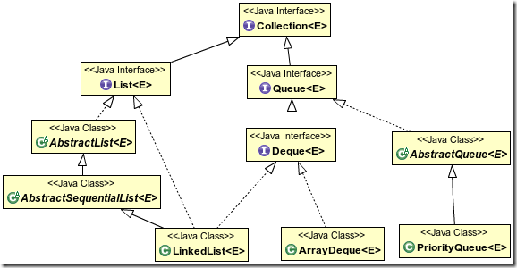
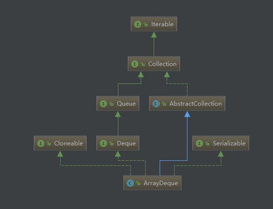
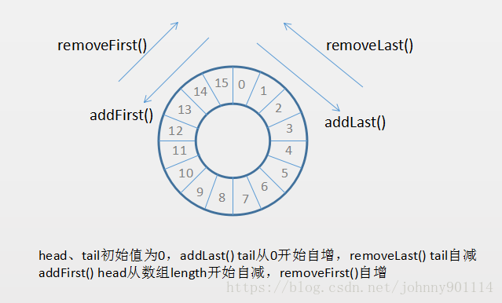
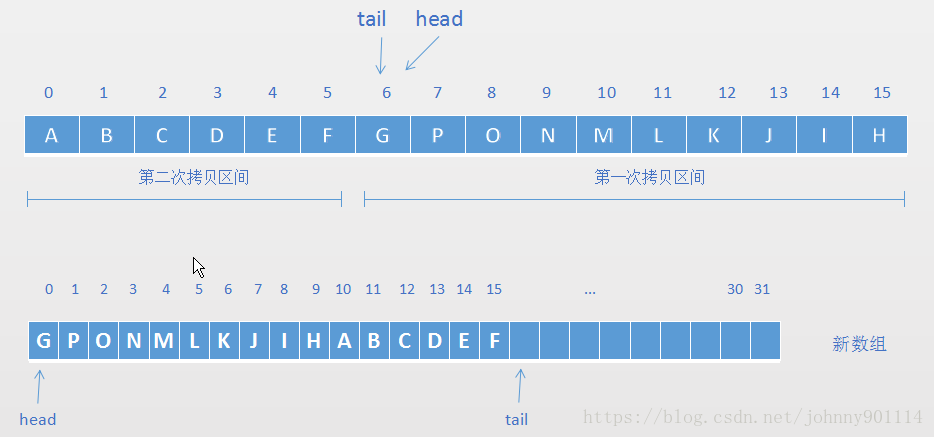
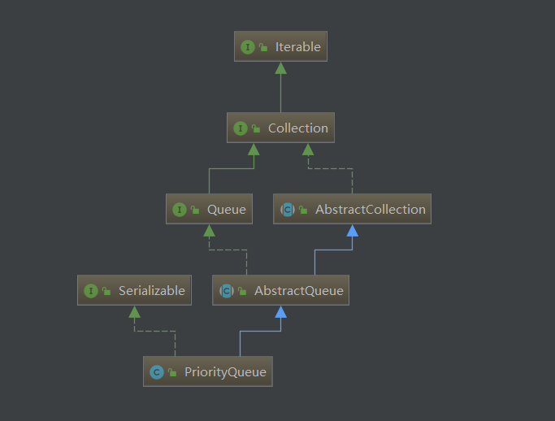

[TOC]

# Queue接口实现类



这里主要介绍优先队列`PriorityQueue、`双端队列`ArrayDeque`。

## ArrayDeque

+ **`ArrayDeque`不可以存取`null`元素**，因为系统根据某个位置是否为`null`来判断元素的存在。 

+ `ArrayDeque`是双端队列支持首尾存取，并且底层是数组。当作为栈使用时，性能比`Stack`好；当作为队列使用时，性能比`LinkedList`好。  
+ `ArrayDeque`底层是动态数组，支持双向迭代器遍历。



蓝线继承，绿线实现。

`ArrayDeque`没有实现`List`、`RandmoAccess`、`ListIterator`接口，因此不支持随机存取，也不能通过索引操作——可以通过`Iterator`遍历，是操作受限的线性表，因此它对队列、双端队列、堆栈的行为有较好的支持。

### ArrayDeque的数据结构

`ArrayDeque`的数据结构是循环队列，它有成员变量<a href="# ArrayDeque的成员变量">`tail，head`</a>支持循环队列的实现。 

 **循环队列（数组形式）的原理** 

当用链表实现循环队列时，就是双向循环链表——`LinkedList`。

让我们看一些`ArrayDeque`源码中是怎样实现循环队列的。  

```java
public void addFirst(E e) {
    //省略无关代码
    head = (head - 1) & (elements.length - 1)
}

public void addLast(E e) {
    //省略无关代码
    tail = (tail + 1) & (elements.length - 1)
}

public E pollFirst() {
    //省略无关代码
    head = (head + 1) & (elements.length - 1);
}

public E pollLast() {
    tail = (tail - 1) & (elements.length - 1);
    //省略无关代码
}
```

好像并没有看到应该出现的取模运算，然而实际上进行了取模运算。`ArrayDeque`是通过位运算来实现循环队列的，这个技巧在Java 集合框架中应用很多（实际的`%`运算很慢。）。 

对%和&进行了一个简单的性能测试，对 0~Integer.MAX 所有的数分别%和& ，消耗的时间如下：

>  % time: 1.847528994 sec
>  & time: 0.00163733 sec

用`&`运算代替`%`运算是有限制的——要被取模的数必须是2的整数幂才成立，如：

> n % 4 = n & 3
> n % 8 = n & 7

至于为什么能够肆无忌惮的在`ArrayDeque`中使用`&`由`ArrayDeque`的扩容方式有关。

### ArrayDeque的成员变量

```java
//存储元素的数组
transient Object[] elements; // 非private访问限制，以便内部类访问

//头部节点序号
transient int head;

//尾部节点序号，（指向最后一点节点的后一个位置）
transient int tail;

//双端队列的最小容量，必须是2的幂
private static final int MIN_INITIAL_CAPACITY = 8;
```

### ArrayDeque的构造方法

```java
/**
     * 构造一个初始容量为16的空队列
     */
    public ArrayDeque() {
        elements = new Object[16];
    }

    /**
     * 构造一个能容纳指定大小的空队列
     */
    public ArrayDeque(int numElements) {
        calculateSize(numElements);
    }

    /**
     * 构造一个包含指定集合所有元素的队列
     */
    public ArrayDeque(Collection<? extends E> c) {
        calculateSize(c.size());
        addAll(c);
    }
```

`ArrayDeque`默认构造函数会初始化容量为16（$2^4$）的数组，也支持在构造的时候传递容量参数，但是此时会调用`calculateSize()`方法。这个方法和ArrayDeque的扩容方式有关。

### ArrayDeque的扩容方式

**指定容量的`ArrayDeque`，实现方法**

```java
private void calculateSize(int numElements) {
    int initialCapacity = MIN_INITIAL_CAPACITY;
    if (numElements >= initialCapacity) {
        initialCapacity = numElements;
        initialCapacity |= (initialCapacity >>>  1);
        initialCapacity |= (initialCapacity >>>  2);
        initialCapacity |= (initialCapacity >>>  4);
        initialCapacity |= (initialCapacity >>>  8);
        initialCapacity |= (initialCapacity >>> 16);
        initialCapacity++;

        if (initialCapacity < 0)   // 如果initialCapacity为负数
            initialCapacity >>>= 1;// Good luck allocating 2 ^ 30 elements
    }
    elements = new Object[initialCapacity];
}
```

如果传递进来的容量小于默认容量8，则使用默认容量。传递进来的参数可能不是2幂，需要对其进行5次右移和或操作保证最终的容量大小是2的幂。从而达到支持位运算来替换取模的目的。

上面的位操作是为了得到距离`numElement`最近的2的整数幂，原理不再赘述。我们写一个程序验证一下结果

> numElements=1  after operation, numElements=2
> numElements=2  after operation, numElements=4
> numElements=3  after operation, numElements=4
> numElements=4  after operation, numElements=8
> numElements=5  after operation, numElements=8
> numElements=6  after operation, numElements=8
> numElements=7  after operation, numElements=8
> numElements=8  after operation, numElements=16
> numElements=9  after operation, numElements=16
> numElements=10  after operation, numElements=16

通过`calculateSize()`方法保证初始化时，`ArrayDeque`的容量是2的整数倍，当`tail=head`时，`ArrayDeque`会通过`doubleCapacity()`扩容为原来的两倍，重置`head=0，tail=n`（未扩容前元素数目`elements.length`）。

```java
private void doubleCapacity() {
    assert head == tail;
    int p = head;
    int n = elements.length;
    int r = n - p; // number of elements to the right of p
    int newCapacity = n << 1;
    if (newCapacity < 0)
        throw new IllegalStateException("Sorry, deque too big");
    Object[] a = new Object[newCapacity];
    System.arraycopy(elements, p, a, 0, r);
    System.arraycopy(elements, 0, a, r, p);
    elements = a;
    head = 0;
    tail = n;
}
```

为什么会使用两次`System.arrcopy()`，因为开始复制时元素分为两部分[`0,tail)、[head,Capacity)`此时`tail==head`  ，复制结束两段到一个内存的一端，并将元素按照从头到尾的顺序排序即`[head,tail)`。



### ArrayDeque的主要方法

有类图可知，`ArrayDeque`继承了`Collection、Queue、Deque`接口的方法

<a href="# Collection与List接口方法">Collection接口方法</a>

<a href="# Queue与Deque接口方法">Queue与Deque接口方法</a>

除此之外新增了方法，支持反向迭代

```java
Iterator<E> descendingIterator() 			//返回逆向迭代器
boolean removeFirstOccurrence(Object o)		//正向遍历删除第一个匹配的元素
boolean removeLastOccurrence(Object o)		//逆向遍历删除第一个匹配的元素
```

## PriorityQueue



`PriorityQueue`是基于数组的优先队列，其内部数据结构是堆，优先队列故名思义`PriorityQueue`是可以根据给定的优先级顺序进行出队的。

优先队列不允许`null`空值，而且不支持non-comparable（不可比较）的对象，比如用户自定义的类——要实现`Comparable`接口。并且在排序时会按照优先级处理其中的元素，默认情况下按照插入元素的自然顺序进行排序，可以指定`Comparator`。

`PriorityQueue`实现了`Queue`、`Collection`接口，只可以通过迭代器遍历。

`PriorityQueue`支持容量动态扩展。

### PriorityQueue的数据结构

`PriorityQueue`的数据结构其实是通过完全二叉树实现的小顶堆（默认排序方式）的结构进行存储的，所谓小顶堆顾名思义堆顶元素是按照排序方式最小的元素。 

**由于树形结构的原因PriorityQueue插入删除元素的复杂度为$O(log(n))$，获取堆顶元素的复杂度为$O(1)$**   。


**可以看到父节点比左右子节点小，而左右子节点则相对无序。**

插入元素、移除元素都会影响整个堆得结构，我们根据图解了解一下小顶堆是如何插入、移除元素的。

#### 插入元素

插入元素的调整其实很简单，就是先插入到最后，然后再依次与其父节点进行比较，如果小于其父节点，则互换，直到不需要调整或者父节点为`null`为止。

`add()`通过调用`offer()`实现元素添加。

```java
//offer(E e)
public boolean offer(E e) {
    if (e == null)//不允许放入null元素
        throw new NullPointerException();
    modCount++;
    int i = size;
    if (i >= queue.length)
        grow(i + 1);//自动扩容
    size = i + 1;
    if (i == 0)//队列原来为空，这是插入的第一个元素
        queue[0] = e;
    else
        siftUp(i, e);//调整
    return true;
}   
```

`siftUp()`方法，会根据比较器的进行堆的调整，小顶堆调整方式就如下图所示。


#### 移除元素

`PriorityQueue`只能移除堆顶元素。移除堆顶元素会将末尾的元素插入到堆顶，然后调整堆的结构。

`remove()`通过调用`poll() ` 返回堆顶元素并调用`siftDown()`调整堆的结构，。

```java
public E poll() {
    if (size == 0)
        return null;
    int s = --size;
    modCount++;
    E result = (E) queue[0];//0下标处的那个元素就是最小的那个
    E x = (E) queue[s];
    queue[s] = null;
    if (s != 0)
        siftDown(0, x);//调整
    return result;
}
```


#### 移除指定元素

`remove(Object o)`方法用于删除队列中跟`o`相等的某一个元素（如果有多个相等，只删除一个（`queue`数组下标最小的那个）），该方法不是*`Queue`*接口内的方法，而是*`Collection`*接口的方法。由于删除操作会改变队列结构，所以要进行调整；又由于删除元素的位置可能是任意的，所以调整过程比其它函数稍加繁琐。具体来说，`remove(Object o)`可以分为2种情况：

1. 删除的是最后一个元素。直接删除即可，不需要调整。
2. 删除的不是最后一个元素，将最后的元素移动到当前位置，调整堆结构

```java
// 这里不是移除堆顶元素，而是移除指定元素
    public boolean remove(Object o) {
        // 先找到该元素的位置
        int i = indexOf(o);
        if (i == -1)
            return false;
        else {
            removeAt(i);
            return true;
        }
    }

```


#### 将无序元素转化为二叉堆

`PriorityQueue`的构造函数支持将其他容器转化为`PriorityQueue`此时可能会重新调整元素之间的结构，主要通过`heapify()`对每个节点进行调整。

```java
  private void heapify() {
        // 从最后一个非叶子节点开始从下往上调整
        for (int i = (size >>> 1) - 1; i >= 0; i--)
            siftDown(i, (E) queue[i]);
    }
```


### PriorityQueue成员变量

```java
	// 默认初始化容量
    private static final int DEFAULT_INITIAL_CAPACITY = 11;

    /**
     * 优先级队列是使用二叉堆表示的: 节点queue[n]的两个孩子分别为
     * queue[2*n+1] 和 queue[2*(n+1)].  队列的优先级是由比较器或者
     * 元素的自然排序决定的， 对于堆中的任意元素n，其后代d满足：n<=d
     * 如果堆是非空的，则堆中最小值为queue[0]。
     */
    transient Object[] queue; 

	//队列中元素个数
    private int size = 0;

    // 比较器
    private final Comparator<? super E> comparator;

   //修改次数
    transient int modCount = 0; 
```

### PriorityQueue构造方法

```java
/**
     * 使用默认的容量（11）来构造一个空的优先级队列，使用元素的自然顺序进行排序（此时元素必须实现comparable接口）
     */
    public PriorityQueue() 

    /**
     * 使用指定容量来构造一个空的优先级队列，使用元素的自然顺序进行排序（此时元素必须实现comparable接口）
     * 但如果指定的容量小于1则会抛出异常
     */
    public PriorityQueue(int initialCapacity) 

    /**
     * 使用默认的容量（11）构造一个优先级队列，使用指定的比较器进行排序
     */
    public PriorityQueue(Comparator<? super E> comparator) 

    /**
     * 使用指定容量创建一个优先级队列，并使用指定比较器进行排序。
     * 但如果指定的容量小于1则会抛出异常
     */
    public PriorityQueue(int initialCapacity,
                         Comparator<? super E> comparator) 

    /**
     * 使用指定集合的所有元素构造一个优先级队列，
     * 如果该集合为SortedSet或者PriorityQueue类型，则会使用相同的顺序进行排序，
     * 否则，将使用元素的自然排序（此时元素必须实现comparable接口），否则会抛出异常
     * 并且集合中不能有null元素，否则会抛出异常
     */
    @SuppressWarnings("unchecked")
    public PriorityQueue(Collection<? extends E> c) 

    /**
     * 使用指定的优先级队列中所有元素来构造一个新的优先级队列.  将使用原有顺序进行排序。
     */
    @SuppressWarnings("unchecked")
    public PriorityQueue(PriorityQueue<? extends E> c) 

    /**
     * 根据指定的有序集合创建一个优先级队列，将使用原有顺序进行排序
     */
    @SuppressWarnings("unchecked")
    public PriorityQueue(SortedSet<? extends E> c) 
```

### PriorityQueue常用方法

<a href="# Collection接口方法">Collection接口方法</a>

```java
boolea add(E e)			 	 //在队首添加一个元素
E remove()					//移除并返回队列头部的元素
E element()					//返回队列头部的元素 
```

**失败会抛出异常**


## Collection接口方法

```java
//继承自Collection的方法

boolean add(E e)  						//向Collection末尾中添加元素
boolean addAll(Collection<? extends E> c) //把Collectionc中的所有元素添加到指定的Collection里
void clear() 							//清除Collection中的元素，长度变为0
boolean contains(E o) 				 //返回Collection中是否包含指定元素
boolean containsAll(Collection<?> c) 	  //返回Collection中是否包含Collectionc中的所有元素
int hashCode() 							//返回此Collection的哈希码值。 
boolean isEmpty() 						//返回Collection是否为空
Iterator<E> iterator() 					 //返回一个Iterator对象，用于遍历Collection中的元素
boolean remove(E o)   				     //删除Collection中与指定元素匹配的第一个元素
boolean removeAll(Collection<?> c)  	  //删除c中的所有对象
default boolean removeIf(Predicate<? super E> filter) //删除此Collection中满足给定谓词的所有元素 
boolean retainAll(Collection<?> c)  	  //仅保留c中的对象
int size()  						    //返回Collection里元素的个数
E[] toArray()  							//把Collection转化为一个数组
<T> T[] toArray(T[] a)  				 //把Collection转化为一个指定类型的数组，推荐使用此种方式
    
```

## Queue与Deque接口方法

**注意，下列方法失败会抛出异常**

`Queue`对队列行为的支持：

```java
boolea add(E e)			 	 //在队首添加一个元素
E remove()					//移除并返回队列头部的元素
E element()					//返回队列头部的元素 
```

`Deque`支持对双端队列行为的支持：

```java
boolean addFirst(E e)		//在队首插入元素
boolean addLast(E e)		//在队尾插入元素
E removeFirst()			   //返回并移除队首元素
E removeLast()			   //返回并移除队尾元素
E getFirst() 			   //返回队首元素
E getLast()			   	   //返回队尾元素
int size() 				   //返回Deque中的元素数
```

`Deque`支持堆栈行为：

```java
void push(E e)			  //向栈顶添加元素
E pop()					 //弹出栈顶元素
E peek() 				 //获取但不弹出栈顶
```

## 源码与参考资料

### 添加元素源码

```java
//offer(E e)
public boolean offer(E e) {
    if (e == null)//不允许放入null元素
        throw new NullPointerException();
    modCount++;
    int i = size;
    if (i >= queue.length)
        grow(i + 1);//自动扩容
    size = i + 1;
    if (i == 0)//队列原来为空，这是插入的第一个元素
        queue[0] = e;
    else
        siftUp(i, e);//调整
    return true;
}
/** 
 * 
 * 节点的调整：从此节点开始，由上至下进行位置调整。把小值上移。 
 * 可以称之为一次筛选，从一个无序序列构建堆的过程就是一个不断筛选的过程. 
 * 直到筛选到的节点为叶子节点，或其左右子树均大于此节点就停止筛选。 
 */  
private void siftDown(int k, E x) {  
    if (comparator != null)       
        siftDownUsingComparator(k, x);  
    else        //如果比较器为空，则按自然顺序比较元素  
        siftDownComparable(k, x);  
}  
  
/** 
 * 比较器为空的一趟筛选过程。 
 * PS:元素必须自己已经实现了Comparable方法 
 * 否则将抛出异常 
 */  
private void siftDownComparable(int k, E x) {  
    Comparable<? super E> key = (Comparable<? super E>)x;   //父节点值  
    int half = size >>> 1;        // loop while a non-leaf  
    while (k < half) {       //如果还不是叶子节点  
        int child = (k << 1) + 1; //左子节点索引，先假设其值最小  
        Object c = queue[child];  
        int right = child + 1;      //右子节点索引  
        if (right < size &&  
            ((Comparable<? super E>) c).compareTo((E) queue[right]) > 0)   //如果左节点大于右节点  
            c = queue[child = right];   //右节点为最小值  
        if (key.compareTo((E) c) <= 0)   //如果父节点小于左右节点中的最小值，则停止筛选  
            break;  
        queue[k] = c;   //小值上移  
        k = child;      //沿着较小值继续筛选  
    }  
    queue[k] = key; //把最先的父节点的值插入到正确的位置  
}  
  
/** 
 * 比较器不为空的一趟筛选过程 
 * 一样的 
 */  
private void siftDownUsingComparator(int k, E x) {  
    int half = size >>> 1;  
    while (k < half) {  
        int child = (k << 1) + 1;  
        Object c = queue[child];  
        int right = child + 1;  
        if (right < size &&  
            comparator.compare((E) c, (E) queue[right]) > 0)  
            c = queue[child = right];  
        if (comparator.compare(x, (E) c) <= 0)  
            break;  
        queue[k] = c;  
        k = child;  
    }  
    queue[k] = x;  
}  
```


### 删除堆顶元素源码

```java
public E poll() {
    if (size == 0)
        return null;
    int s = --size;
    modCount++;
    E result = (E) queue[0];//0下标处的那个元素就是最小的那个
    E x = (E) queue[s];
    queue[s] = null;
    if (s != 0)
        siftDown(0, x);//调整
    return result;
}

/** 
 * 添加元素后，重新调整堆的过程，这里从下向上调整x的位置。 
 * 这比初始构建堆更简单 
 */  
private void siftUp(int k, E x) {  
    if (comparator != null)  
        siftUpUsingComparator(k, x);  
    else  
        siftUpComparable(k, x);  
}  
  
private void siftUpComparable(int k, E x) {  
    Comparable<? super E> key = (Comparable<? super E>) x;  
    while (k > 0) {      //<=0就不用调整了  
        int parent = (k - 1) >>> 1;        //x的父节点  
        Object e = queue[parent];  
        if (key.compareTo((E) e) >= 0)   //如果x小于parent则终止调整  
            break;  
        queue[k] = e;   //否则父节点向下移，x为父节点  
        k = parent;     //从x处继续调整  
    }  
    queue[k] = key;  
}  
  
/** 
 * 同上 
 */  
private void siftUpUsingComparator(int k, E x) {  
    while (k > 0) {  
        int parent = (k - 1) >>> 1;  
        Object e = queue[parent];  
        if (comparator.compare(x, (E) e) >= 0)  
            break;  
        queue[k] = e;  
        k = parent;  
    }  
    queue[k] = x;  
} 
```


### 删除指定元素源码

```java
// 这里不是移除堆顶元素，而是移除指定元素
    public boolean remove(Object o) {
        // 先找到该元素的位置
        int i = indexOf(o);
        if (i == -1)
            return false;
        else {
            removeAt(i);
            return true;
        }
    }
    // 移除指定序号的元素
    private E removeAt(int i) {
        // assert i >= 0 && i < size;
        modCount++;
        // s为最后一个元素的序号
        int s = --size;
        if (s == i) 
            queue[i] = null;
        else {
            // moved记录最后一个元素的值
            E moved = (E) queue[s];
            queue[s] = null;
            // 用最后一个元素代替要移除的元素，并向下进行调整
            siftDown(i, moved);
            // 如果向下调整后发现moved还在该位置，则再向上进行调整
            if (queue[i] == moved) {
                siftUp(i, moved);
                if (queue[i] != moved)
                    return moved;
            }
        }
        return null;
    }
```

### 参考资料

[数据结构与算法（四）队列和Java ArrayDeque](https://blog.csdn.net/johnny901114/article/details/80456833)

[【Java入门提高篇】Day33 Java容器类详解（十五）PriorityQueue详解](https://cloud.tencent.com/developer/article/1331803)

[深入理解Java PriorityQueue](https://www.cnblogs.com/CarpenterLee/p/5488070.html)