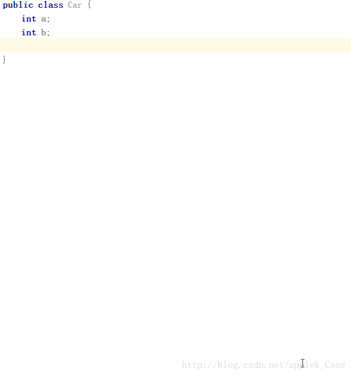

# 实现元素比较

## ==、equals、compareTo的关系

+ `==` 是对对象地址的比较，而`equals`是对对象内容的比较。对于基本数据类型（不包括其包装类和`String`），一般用`==`；而对于字符串的比较，一般用`equals`。

   + **对于基本数据类型使用`==`会比较其值的关系，对于包装类则是对象地址的比较，使用`equals`可以实现值得比较，尤其是`String`对象。** 

+ 对于自定义数据类型，会继承父类方法`equals()`——没有显式父类会**继承`Object.equals()` 其实质是对对象地址的比较**

+ `equals`、`compareTo`有事会被用于不同的场合，做出区分十分有必要。在`Comparable`接口中，JavaAPI给出如下建议：

   强烈建议`(x.compareTo(y) == 0) == (x.equals(y))`，但是这个并非绝对必要。一般来说，任何实现了`Comparable`接口的类，若违反了这个条件，都应该明确予以说明。推荐使用这样的说法：“注意，该类具有内在的排序功能，但是与`equals`不一致”。

   这是一个强烈的建议，而不是真正的规则，只是说明了`compareTo`方法施加的同等性测试，在通常情况下就应该返回与`equals`方法同样的结果。如果遵守了这一条规定，那么由`compareTo`方法所施加的关系顺序就会被认为”于`equals`一致”。如果违反了这条规则，则不然。

   如果一个类的`compareTo`方法施加了一个与`equals`方法不一致的顺序关系，它仍然能够工作，**但是如果有一个有序集合(sorted collection)包含了该类的元素，这个集合就可能无法遵守相应集合接口(`Collection`、`Set`或`Map`)的通用约定**。这是因为，**对于这些接口的通用约定是按照`equals`方法来定义的，但是有序容器时使用由`compareTo`方法而不是`equals`方法所施加的同等性测试。** （是否需要重写`equals`方法，具体情况具体分析）

   例如，考虑`BigDecimal`类，它的`compareTo`方法和`equals`方法不一致。如果你创建了一个`HashSet`（非有序容器）实例，并且添加了`new BigDecimal(“1.0”)`和`new BigDecimal(“1.00”)`，这个集合就将包含两个元素，因为新增到集合中的两个`BigDecimal`实例，通过`equals`方法来比较的时候是不相等的。然而如果你使用`TreeSet`（有序容器）来执行同样的过程，集合中将只包含一个元素，因为这两个`BigDecimal`实例在通过`compareTo`方法进行比较的时候是相等的。

   **依赖于`CompareTo`的类包括有序容器类`TreeSet`和`TreeMap`、`PriorityQueue`以及工具类`Collections`和`Arrays`，它们内部包含有搜索和算法排序。** 

   **依赖`equals`的类有`HashSet、HashMap` 。**

## 重写equals方法

**依赖`equals`的类有`HashSet、HashMap` 这些类所持有的对象必须重写`equals`。**

在类`Object`中定义了`equals`方法。 

```java
public boolean equals(Object obj) {   return (this == obj);     }
```

默认情况下，比较的是对象的地址，因此要实现对对象内容的比较就需要重现`equals`方法。

### equals重写的规范

+ 自反性。对于任何非`null`的引用值`x`，`x.equals(x)`应返回`true`。

+ 对称性。对于任何非`null`的引用值`x`与`y`，当且仅当：`y.equals(x)`返回`true`时，`x.equals(y)`才返回`true`。

+ 传递性。对于任何非`null`的引用值`x`、`y`与`z`，如果`y.equals(x)`返回`true`，`y.equals(z)`返回`true`，那么`x.equals(z)`也应返回`true`。

+ 一致性。对于任何非`null`的引用值`x`与`y`，假设对象上`equals`比较中的信息没有被修改，则多次调用`x.equals(y)`始终返回`true`或者始终返回`false`。

当然在通常情况下，如果只是进行同一个类两个对象的相等比较，一般都可以满足以上5点要求。

### 为什么重写equals的同时还得重写hashCode

首先， `hashCode()`是为了支持哈希表类的如`HashMap`，`HashTable`之类的底层使用了哈希表的类。

```java
    public native int hashCode();
    public boolean equals(Object obj) {
        return (this == obj);
    }
```

光从代码中我们可以知道，`hashCode()`方法是一个本地native方法，返回的是对象引用中存储的对象的内存地址，而`equals()`方法是利用`==`来比较的也是对象的内存地址。从上边我们可以看出，`hashCode`方法和`equals`方法是一致的。

Java给出了hashCode的如下规范：

1. 在 Java 应用程序执行期间，在对同一对象多次调用 hashCode 方法时，必须一致地返回相同的整数，前提是将对象进行 `equals` 比较时所用的信息没有被修改。从某一应用程序的一次执行到同一应用程序的另一次执行，该整数无需保持一致。    

2. 如果根据 equals(Object) 方法，两个对象是相等的，那么对这两个对象中的每个对象调用 hashCode 方法都必须生成相同的整数结果。    
3. 如果根据 equals(Object) 方法，两个对象不相等，那么对这两个对象中的任一对象上调用 hashCode 方法不 要求一定生成不同的整数结果。但是，程序员应该意识到，为不相等的对象生成不同整数结果可以提高哈希表的性能。

默认的hashCode是通过对象的地址计算出来的，默认的`equals`方法对于相同地址返回`true`，这符合第2条规范。

如果一个类重写了`equals`方法，但没有重写`hashCode`方法，将会直接违法了第2条规定——令`equals`返回`true`的两个对象地址不同，其`hashCode`也并不相同。这样的话，如果我们通过映射表(Map接口)操作相关对象时，就无法达到我们预期想要的结果。

### 快速生成hashCode和equals

我把《Effective Java》介绍的套路放在最后，有兴趣的可以查看

#### 使用Objects的静态方法

**Objects** 是 Object 的工具类，它由一些静态的实用方法组成，用于计算对象的`hashcode`、返回对象的字符串表示形式、比较两个对象。

```java
public static boolean equals(Object a, Object b)
/*比较对象a和对象b，使用的是第一个参数的equals()方法，
如果两个参数中有一个是null，则返回false，
如果两个参数都是null，则返回true。*/

public static int hash(Object... values)
/*得到一列对象的hash code，
使用的其实是Arrays.hashCode(Object[])，Object[]数组元素就是hash方法传入的参数值*/

public static int hashCode(Object o)
/*得到一个对象的hash code，如果参数为null，返回0*/
```

 **示例**

```java
class Foo {
  private String name;
  private String id;

  @Override
  public int hashCode() {
    return Objects.hash(name,id);
  }

  @Override
  public boolean equals(Object obj) {
    if (obj instanceof Foo) {
      Foo right = (Foo) obj;
      return Objects.equals(name,right.name) && Objects.equals(id,right.id);
    }
    return false;
  }
}
```


#### IDE自动生成hashCode与equals的方式

使用IntelliJ IDEA: 

键盘： Alt + Insert 笔记本 ： 

可以看到 insert 在PgDn那个键，Fn + Alt + insert(PgDn)



Eclipes也有相应的插件，这里不介绍。

### 总结

对于重写`equals`和`hashCode`方法也不用刻意去记忆，只要知道在需要逻辑等和需要把类的实例作为像`HashMap`这样的`hash`数据结构的键(Key)时候必须重写`equals`和`hashCode`方法就可以了。

## Comparable接口自然排序

很多情况下都要求元素是可以比较的，需要类实现`Comparable`接口，或提供`Comparator`。**依赖于`CompareTo`的类包括有序容器类`TreeSet`和`TreeMap`、`PriorityQueue` 如果不提供比较器需要实现`Comparable`接口。 ** 

对于那些需要排序的方法，容器有两种方式：一是实体类实现`Comparable`接口，重写`CompareTo()`；二是编写`Comparator`对象。

这两种方式并没有太大差异，哪一个方便可以用哪个。

`Comparable`接口是一个泛型接口。Java类库中：`Byte`，`Short`，`Integer`，`Long`，`Float`，`Double`，`Character`，`BigTnteger`，`BigDecimal`，`Calendar`，`String`类都实现了`Comparable`接口。可以直接比较，对于没有实现的类，可以通过`implements Comparable`接口实现。 

实现了`Comparable` 能够实现：

- 调用 `Collections.sort` 、 `Collections.binarySearch`
- 调用 `Arrays.sort` 、 `Arrays.binarySearch`
- 在`TreeMap ` 将对象`object`作为键
- 在`TreeSet` 将对象`object`作为其中的元素

接口定义

```java
Interface Comparable<T>
{
    int compareTo(T o);
}
```

`compareTo`方法判断对用此方法的对象`this`相对于比较对象`o`的顺序,小于返回负整数，等于返回0，大于返回正整数。**`compareTo()`称为它的*自然比较方法* ，它规定的顺序成为自然顺序。** 

### 规范 

 `compareTo`方法的通用约定和`equals`方法的相似，将一个对象与指定对象进行比较。当该对象小于、等于或者大于指定对象的时候，分别返回一个负整数、零或者正整数。如果由于指定对象的类型而无法和该对象进行比较，则抛出`ClassCastException`异常。

在下面的说明中，符号`sgn`(表达式)表示数学中的`signum`函数，它根据表达式(expression)的值为负值、零和正值，分别返回-1、0、1。

+ 必须确保所有的`x`和`y`都满足`sgn(x.compareTo(y)) == -sgn(y.compareTo(x))`。这也暗示着当且仅当`y.compareTo(x)`抛出异常时，`x.compareTo(y)`才抛出异常。这条规则和`equals`使用规范里面的对称性类似。
+ 必须确保这个比较关系是可传递的：`(x.compareTo(y) > 0 && y.compareTo(z) > 0)`暗示着`x.compareTo(z) > 0`也成立。对应着`equals`使用规范里面的传递性。
+ 必须确保`x.compareTo(y) == 0`暗示着所有的z都满足`sgn(x.compareTo(z)) == sgn(y.compareTo(z))`。
+ 强烈建议`(x.compareTo(y) == 0) == (x.equals(y))`，但是这个并非绝对必要。一般来说，任何实现了`Comparable`接口的类，若违反了这个条件，都应该明确予以说明。推荐使用这样的说法：“注意，该类具有内在的排序功能，但是与`equals`不一致”。

因为`Compareable`接口时参数化的，而且`comparable`方法是静态的类型，因此**不必进行类型检查，也不需要对它的参数进行类型的转换**。如果参数的类型不合适，这个调用甚至无法编译。如果参数为`null`,这个调用。如果参数为`null`，这个调用应该抛出`NullPointerException`异常，并且一旦该方法试图访问它的成员变量时就应该抛出。


### 示例

```java
**
 * description: 测试用的实体类 书, 实现了 Comparable 接口，自然排序
 */
public class BookBean implements Comparable {
    private String name;
    private int count;

    public BookBean(String name, int count) {
        this.name = name;
        this.count = count;
    }

    public String getName() {
        return name;
    }

    public void setName(String name) {
        this.name = name;
    }

    public int getCount() {
        return count;
    }

    public void setCount(int count) {
        this.count = count;
    }
//先按书价排序，若想等在按书名排序
    @Override
  public int compareTo(Object another) throws NullPointerException {
        if(another==null) throw  new NullPointerException();
        
            BookBean anotherBook = (BookBean) another;
            int result;
            //比如这里按照书价排序
            result = getCount() - anotherBook.getCount();     
            if (result == 0)   //当书价一致时，再对比书名。 保证所有属性比较一遍
                result = getName().compareTo(anotherBook.getName());
            return result;
    }
     public static void main(String args[])
    {
        List<BookBean> list=new ArrayList<>();
        list.add(new BookBean("cba",20));
        list.add(new BookBean("abc",10));
        list.add(new BookBean("bbb",15));
        list.add(new BookBean("aaa",10));
        Collections.sort(list);
        for(BookBean book:list){
            System.out.println("name:"+book.getName()+" count:"+book.getCount());
        }
    }
}
/*Output
name:aaa count:10
name:abc count:10
name:bbb count:15
name:cba count:20
*/
```

## comparator定制排序

`Comparator` 是一个泛型接口，它提供了比较器的接口。 

```java
public interface Comparator<T> {
    public int compare(T lhs, T rhs);
    public boolean equals(Object object);
}
```

 `Comparator` 是在外部制定排序规则，然后作为排序策略参数传递给某些方法，比如 `Collections.sort()`, `Arrays.sort()`, 或者一些内部有序的容器的构造方法做参数（比如 `SortedSet`，`SortedMap` ，`PriorityQueue`等）。

**注意：由于`Object`类中定义了`equals()`方法，并且所有类都继承自`Object`类，因此`equals`不必实现也行。**

### 示例

```java
import java.util.ArrayList;
import java.util.Collections;
import java.util.Comparator;
import java.util.List;

public class SortTest {
    class Dog{
    public int age;
    public String name;
    public Dog(int age, String name) {
        super();
        this.age = age;
        this.name = name;
    }
    @Override
    public String toString() {
        return "Dog [age=" + age + ", name=" + name + "]";
   	 }
    }
    public static void main(String[] args) {
    List<Dog> list= new ArrayList<>();
    list.add(new SortTest().new Dog(5, "DogA"));
    list.add(new SortTest().new Dog(6, "DogB"));
    list.add(new SortTest().new Dog(7, "DogC"));
	System.out.println("给狗狗按照年龄倒序："+list);
    Collections.sort(list, new Comparator<Dog>() {//匿名内部类
        @Override
        public int compare(Dog o1, Dog o2) {
        return o2.age - o1.age;
        }
    });
    }
}
/*Output:
给狗狗按照年龄倒序：[Dog [age=7, name=DogC], Dog [age=6, name=DogB], Dog [age=5, name=DogA]]*/
```

## 重写equals方法的标准套路

下面就介绍一下《Effective Java》中教我们的重写`equals`方法的套路：

1. 使用`==`操作符检查"**参数是否为这个对象的引用**" 。如果是，则返回`true`
2. 使用`instanceof` 操作符检查"**参数是否为正确的类型**"。如果不是，则直接返回`false`
3. **把参数转换成正确的类型** 。因为转换之前进行过`instanceof`测试，所以确保会成功。
4. 对于该类中的每个关键域，**检查参数中的域是否与该对象中对应的域相匹配** 。如果这些测试全部成功，则返回true ，否则返回`false`。

**当编写完成了equals方法之后，应该问自己三个问题:它是否是对称的、传递的、 一致的?**

**注意equals的参数是Object如果参数类型不同，只是重载，不是重写。所以重写equals方法尽量加上@Override注解**

```java
@Override
public boolean equals(Object obj)
```

几个示例

```java
//JDK中的String类重写的equals方法
public boolean equals(Object anObject) {
        if (this == anObject) {
            return true;
        }
        if (anObject instanceof String) {
            String anotherString = (String) anObject;
            int n = value.length;
            if (n == anotherString.value.length) {
                char v1[] = value;
                char v2[] = anotherString.value;
                int i = 0;
                while (n-- != 0) {
                    if (v1[i] != v2[i])
                            return false;
                    i++;
                }
                return true;
            }
        }
        return false;
    }
//redis.clients.jedis.GeoCoordinate类的equals方法
@Override
  public boolean equals(Object o) {
    if (this == o) return true;
    if (!(o instanceof GeoCoordinate)) return false;

    GeoCoordinate that = (GeoCoordinate) o;

    if (Double.compare(that.longitude, longitude) != 0) return false;
    return Double.compare(that.latitude, latitude) == 0;
  }
 //com.alibaba.fastjson.util.ParameterizedTypeImpl的equals方法
  @Override
    public boolean equals(Object o) {
        if (this == o) return true;
        if (o == null || getClass() != o.getClass()) return false;

        ParameterizedTypeImpl that = (ParameterizedTypeImpl) o;

        // Probably incorrect - comparing Object[] arrays with Arrays.equals
        if (!Arrays.equals(actualTypeArguments, that.actualTypeArguments)) return false;
        if (ownerType != null ? !ownerType.equals(that.ownerType) : that.ownerType != null) return false;
        return rawType != null ? rawType.equals(that.rawType) : that.rawType == null;
    }
```

## 重写hashCode的标准套路

重写`hashCode`方法的套路——《Effective Java》

1. 把某个非零的常数值，比如说 `17` ，保存在一个名为`result` 的`int`类型的变量中.
2. 对于对象中每个关键域f(指`equals`方法中涉及的每个域) ，完成以下步骤: 
   -  (a)为该域计算int类型的散列码 
      - 如果该域是 `boolean` 类型，则计算 `(f?1:0)`  
      - 如果该域是`byte` 、`char` 、`short`或者 `int`类型，则计算`(int)f` 
      - 如果该城`long`（64bit）类型，则计算`(int)(f ^ (f >>> 32))` 
      - 如果该域是`float`类型，则计算`Float.floatToIntBits(f)` 转化为`int`计算其散列码
      - 如果该域是`double`类型，则计算 `Double.doubleToLongBits(f)`， 转化为`long`计算散列值
      - 如果该域是一个对象引用，为这个域递归地调用`hashCode`。
         - 如果这个域的的为`null` ，则返回0(或者其他某个常数 ，但通常是0) 
      - 如果该域是一个数组，则要把每一个元素当做单独的域来处理，也就是说，递归地应用上述规则，对每个重要的元素计算 一个散列码也可以使用Arrays.hashCode方法
   - 按照下面的公式，把步骤 2.a 中计算得到的散列码合并到`result`中: `result = 31 * result + c;`
3. 返回 `result`
4. 写完了`hashCode`方法之后，问问自己"相等的实例是否都具有相等的散列码"。要编写单元测试来验证你的推断。如果相等的实例有着不相等的散列码，则要找出原因，并修正错误。

**示例**

```java
//redis.clients.jedis.GeoCoordinate类的hashCode方法：
 @Override
  public int hashCode() {
    // follows IntelliJ default hashCode implementation
    int result;
    long temp;
    temp = Double.doubleToLongBits(longitude);
    result = (int) (temp ^ (temp >>> 32));
    temp = Double.doubleToLongBits(latitude);
    result = 31 * result + (int) (temp ^ (temp >>> 32));
    return result;
  }
//com.alibaba.fastjson.util.ParameterizedTypeImpl的hashCode方法：
 @Override
    public int hashCode() {
        int result = actualTypeArguments != null ? Arrays.hashCode(actualTypeArguments) : 0;
        result = 31 * result + (ownerType != null ? ownerType.hashCode() : 0);
        result = 31 * result + (rawType != null ? rawType.hashCode() : 0);
        return result;
    }
```


## 参考资料

[重写equal()时为什么也得重写hashCode()之深度解读equal方法与hashCode方法渊源](https://blog.csdn.net/javazejian/article/details/51348320)

[第12条：考虑实现Comparable接口](https://blog.csdn.net/Jing_Unique_Da/article/details/49924289)