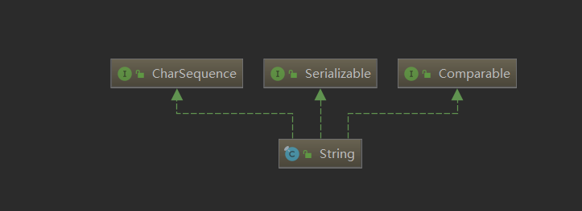
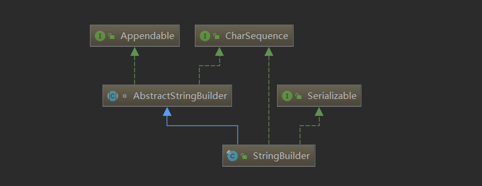

# 字符串

## String类



这里介绍一下`String`类的常用方法

注意`String`是`CharSequence`子类。 

### 构造方法

```java
String() 									//初始化空字符
String(char[] value) 						 //将字符数组的内容转化成字符串
String(char[] value, int offset, int count)    //将字符数组指定区间的内容转化为字符串,offset指定字符数组的起始转化位置，count指定转化的字符数组数目，如果offset+count超过字符数组长度会抛出异常
Sting(String original)						//使用指定字符串初始化
String(StringBuilde builder)				//使用StringBuilde对象进行初始化
static String valueOf(int i)				//返回int参数的字符串形式，valueOf的参数可以是任意的基本数据类型
```


### String的不可变形

`String`对象是不可变的。査看JDK文档你就会发现，`String`类中每一个看起来会修改`String` 值的方法，实际上都是**创建了一个全新的`String`对象**，以包含修改后的字符串内容。而最初的 `String`对象则丝毫未动。

因此当我们使用"`+`"、"`+=`"运算符进行字符串拼接时，实际上也会产生新的`String`对象，效率低下。**当需要进行大量的字符串拼接时，我们可以使用`StringBuilder`对象，调用`append()`方法提高效率。**（`StringBuilder`是可变字符串类型）

```java
 public static void main(String[] args)
    {
       StringBuilder builder=new StringBuilder();
       for(int i=1;i<=5;i++){
           builder.append(i);
           builder.append(" ");
       }
        System.out.println(builder);
    }
    /*Output
    1 2 3 4 5 
    */
```

### String.format

`String`有一个静态方法，可以使用格式化字符串返回特定格式的字符串

```JAVA
public static String format(String format,Object... args)
```

示例：

```java
//将输入的整数转换为16进制字符串
public static void main(String[] args)
    {
        Scanner cin=new Scanner(new BufferedInputStream(System.in));
        StringBuilder builder=new StringBuilder();
        for(int i=0;i<3;i++)
        {
            builder.append(String.format("%h",cin.nextInt()));
            builder.append("\n");
        }
        System.out.println(builder);
    }
/*Output
12
16
32
c
10
20
*/
```

## String的常用方法

```java
//查询
char charAt(int index)				 //获取指定索引位置的字符
int contains(String str) 			   //判断是否包含str
int indexOf(int ch)					 //返回指定字符在此字符串中第一次出现处的索引。
int indexOf(String str)				  //返回指定字符串在此字符串中第一次出现处的索引。
int indexOf(int ch,int fromIndex)	   //返回指定字符在此字符串中从指定位置后第一次出现处的索引。
int indexOf(String str,int fromIndex)   //返回指定字符串在此字符串中从指定位置后第一次出现处的索引。
int	lastIndexof(Sting str)			   //返回指定字符串最后一次出现的索引

//字符串比较
int compareTo(String anotherString)   			//按字典序比较两个字符串
int compareToIgnoreCase(String anotherString)    //比较两个字符串忽略大小写差异
boolean  equals(Object anObject)				//判断此字符串是否与指定对象相同
boolean  equalsIgnoreCase(String anString)		 //判断此字符串是否与指定字符串相同，忽略大小写

//字符串替换
String replace(CharSequence target,CharSequence replacement) //用replacement替换所有target
String replaceAll(String regex, String replacement) 		//用replacement替换与给定的正则表达式regex匹配的每个子字符串。 
String replaceFirst(String regex, String replacement) 		//用replacement替换与给定的正则表达式regex匹配的第一个子字符串。     
   
//字符串分割
String[]	split(String regex)  						//返回一个字符串数组，将原字符串从正则表达式regex匹配的地方分隔
String[]	split(String regex,int limit)  				//返回一个字符串数组，将原字符串从正则表达式regex匹配的地方分隔,limit限定匹配个数    
    
//字符串子串
String substring(int start)				//从指定位置开始截取字符串,默认到末尾。
String substring(int start,int end)		//从指定位置开始到指定位置结束截取字符串(如果含有起点和终点, Java中一般是左闭右开区间, 即end取不到)。
CharSequence subSequence(int from,int to) //返回[from,to)的CharSequence

//字符串拼接
String concat(String str)				//将指定字符串拼接到当前字符串末尾，可以有
static String join(CharSequence link,CharSequence... elements)//用link将多个elements相连

//字符串转换
char[] toCharArray()					//转化为字符数组
String toLowerCase()					//将所有字符串转化为小写字母
String toUpperCase()					//将所有字符串转化为大写字母
String trim()							//删除字符串的所有前导，尾随空格

//字符串匹配
boolean matches(String regex) 			  //返回这个字符串是否与正则表达式regex匹配
    
int length()						   //获取字符串的长度。
boolean isEmpty()					    //判断是否为空串	
```

## String与正则表达式

`String`和正则表达式`regex expression`配合可以增强对字符串的操作能力。

`String`类提供了如下和正则表达式相关的操作

```java
String replaceAll(String regex, String replacement) 		//用replacement替换与给定的正则表达式regex匹配的每个子字符串。 
String replaceFirst(String regex, String replacement) 		//用replacement替换与给定的正则表达式regex匹配的第一个子字符串。     
String[]	split(String regex)  						//返回一个字符串数组，将原字符串从正则表达式regex匹配的地方分隔
String[]	split(String regex,int limit)  				//返回一个字符串数组，将原字符串从正则表达式regex匹配的地方分隔,limit限定匹配个数    
boolean matches(String regex) 			  //返回这个字符串是否与正则表达式regex匹配
```

了解这些方法的使用之前，我们先了解一下正则表达式。

### 正则表达式简介

可以将正则表达式理解为描述字符串的一种语法。这里只介绍一些常用、简单的正则表达式用法。

+ 例如，要找一个数字，它**可能有一个负号**在最前面，那你就写一个负号加上一个问号，就像这样：**"- ?"**
+ 在正则表达式中，用"**\d**"表示一位 数字。**注意Java对反斜线'\'的特殊对待。**
   - 在Java中，**"\\\"**的意思是：我要插入一个反斜线。
   - 如果你想表示一位数字，那么在Java中正则表达式应该是**"\\\d"**。
   - 你想在Java中的正则表达式插入一个普通的反斜线：**"\\\\\\\"** 
   - 不过换行和制表符之类的东西只需使用单反斜线："**\n\te**"
   - 不过换行和制表符之类的东西只需使用单反斜线："**\n\te**"

### 常用的正则表达式词法

在以下表格中出现的字符有特殊含义，因此若想表示它的本来含义要在前面用`\\`转义。

**由于Java中的`\` 也具有转义含义，因此在下列正则表达式中出现的`\` 在Java字符串中数目加倍**

使用`()` 可以将正则表达式分组

| 字符     | 说明                                                         |
| -------- | ------------------------------------------------------------ |
| \        | 将下一字符标记为特殊字符、文本、反向引用或八进制转义符。例如，"n"匹配字符"n"。"\n"匹配换行符。序列"\\\\\\\"匹配"\\\"，"\\\("匹配"("。 |
| ^        | 匹配输入字符串开始的位置。                                   |
| $        | 匹配输入字符串结尾的位置。                                   |
| *        | **零次或多次匹配前面的字符或子表达式**。例如，zo* 匹配"z"和"zoo"。 |
| +        | **一次或多次匹配前面的字符或子表达式**。例如，"zo+"与"zo"和"zoo"匹配，但与"z"不匹配。 |
| ?        | **零次或一次匹配前面的字符或子表达式**。例如，"do(es)?"匹配"do"或"does"中的"do"。 |
| .        | **匹配除"\r\n"之外的任何单个字符。**                         |
| *x*\|*y* | **匹配 *x* 或 *y*。**例如，'z\|food' 匹配"z"或"food"。'(z\|f)ood' 匹配"zood"或"food"。 |
| [*xyz*]  | 字符集。匹配包含的任一字符。例如，"[abc]"匹配"plain"中的"a"。 |
| [^*xyz*] | 反向字符集。匹配未包含的任何字符。例如，"\[^abc]"匹配"plain"中"p"，"l"，"i"，"n"。 |
| [*a-z*]  | 字符范围。匹配指定范围内的任何字符。例如，"[a-z]"匹配"a"到"z"范围内的任何小写字母。 |
| [^*a-z*] | 反向范围字符。匹配不在指定的范围内的任何字符。例如，"\[^a-z]"匹配任何不在"a"到"z"范围内的任何字符。 |
| \n       | 换行符匹配。                                                 |
| \b       | 匹配一个字边界，即字与空格间的位置。例如，"er\b"匹配"never"中的"er"，但不匹配"verb"中的"er"。 |
| \B       | 非字边界匹配。"er\B"匹配"verb"中的"er"，但不匹配"never"中的"er"。 |
| \d       | **数字字符匹配。**等效于 [0-9]。                             |
| \D       | **非数字字符匹配**。等效于 \[^0-9]。                         |
| \s       | **匹配任何空白字符**，包括空格、制表符、换页符等。与 [ \f\n\r\t\v] 等效。 |
| \S       | **匹配任何非空白字符**。与 \[^ \f\n\r\t\v] 等效。            |
| \w       | **匹配任何字类字符**，包括下划线。与"[A-Za-z0-9_]"等效。     |
| \W       | **与任何非单词字符匹配。**与"\[^A-Za-z0-9_]"等效。           |

更多关于正则表达式的内容请查阅相关资料。

### 正则示例

#### String.matches()匹配正则表达式

检査一个 `String`是否匹配如上所述的正则表达式：

```java
//: strings/IntegerHatch.]ava
public class IntegerMatch {
	public static void main(String[] args) {
		System.out.println("-1234".matches("-?\\d+"));
		System.out.println("5678".matches("-?\\d+")); 
		System.out.println("+911".matches("-?\\d+"))； 
		System.out.println("+911".matches("(-|\\+)?\\d+"));
>
} /* Output;
true
true
false
true
*///:~
```

前三个都好理解，第四个正则表达式的描述为：“可能以一个加号或减号开头的一位或多位数字”

#### String.split()从正则表达式匹配的地方分离

`String.split()`方法，其功能是**“将字符串从 正则表达式匹配的地方切开**。” 

```java
//: strings/SpUtting.java	
import java.util.*;

public class Splitting {
    public static String knights = "Then, when you have found the shrubbery, you must " +
            "cut down the mightiest tree in the forest... " +
            "with... a herring!";

    public static void split(String regex) {
        System.out.println(Arrays.toString(knights.split(regex)));
    }

    public static void main(String[] args) {
        split(" "); // 匹配空格
        split("\\W+"); // 非单词字符
        split("n\\W+"); // 'n'后面跟随非单词字符
    }
} /* Output:	
[Then,, when, you, have, found, the, shrubbery,, you, must, cut, down, the, mightiest, tree, in, the, forest..., with..., a, herring!]
[Then, when, you, have, found, the, shrubbery, you, must, cut, down, the, mightiest, tree, in, the, forest, with, a, herring]
[The, whe, you have found the shrubbery, you must cut dow, the mightiest tree i, the forest... with... a herring!] 
*///:~
```

首先看第一个语句，注意这里用的是空白的字符作为正则表达式，其中并不包含任何特殊的字符。因此第一个`Split()`，只是**按空格来划分字符串**。

第二个和第三个`split( )`都用到了**\\\W** ,它的意思是非单词字符(如果W小写**\\\w** ,则表示一 个单词字符)。通过第二个例子可以看到，**它将标点字符删除了(标点符号也是非单词字符)**。第三个`split()`表 示 “字母n后面 跟着一个或多个非单词字符。”可以看到，在原始字符串中，与正则表达式匹配的部分，在最终结果中都不存在了。

#### 替换与正则表达式匹配的地方

你可以只替换正则表达式第一个匹配的子串，或是替换所有匹配的地方。

```java
//: strings/Replacing.java
public class Replacing {
    static String s = "Then, when you have found the shrubbery, you must " +
            "cut down the mightiest tree in the forest... " +
            "with... a herring!";
    public static void main(String[] args) {
        System.out.println(s.replaceFirst("f\\w+", "located"));//只替换第一个匹配的地方
        System.out.println(s.replaceAll("shrubbery|tree|herring","banana"));//替换所有匹配的地方
    }
} /* Output:
Then, when you have located the shrubbery, you must cut down the mightiest tree in the forest... with... a herring!
Then, when you have found the banana, you must cut down the mightiest banana in the forest... with... a banana!
*///:~
```

第一个表达式要匹配的是，以字母f开头，后面跟一个或多个字母(注意这里的W是小写的)。 并且只替换掉第一个匹配的部分，所 以 “found” 被替换成“located”。 

第二个表达式要匹配的是三个单词中的任意一个，因为它们以竖直线分隔表示“或”，并且替换所有匹配的部分。

## StringBuilder类




注意`StringBuilder`是`CharSequence`子类，是可以修改的字符串，可以理解为支持动态扩容的字符数组。

### StringBuilder的构造方法

```java
StringBuilder()				 		// 初始化为空串，并设置容量为16个字节；
StringBuilder(CharSequece seq)  	 //使用seq初始化，容量在此基础上加16；
StringBuilder(int capacity) 		//指定容量
StringBuilder(String str) 			// 使用str初始化，容量str大小的基础上加16；
```

**注意扩容过程效率低下，因此调用构造方法时，可以指定容量大小，避免大量的扩容过程。**

### StringBuilder的常用方法

这里介绍一些字符串更新的方法，用于替换`String`类相应的方法，提高效率。

```java
//字符串添加
StringBuilder append(boolean b)						//将boolean类型参数添加到末尾。append参数可以是任意的基本参数类型
StringBuilder append(char c)
StringBuilder append(char[] str)
StringBuilder append(char[] str,int start,int end)
StringBuilder append(CharSequence s)				   //将指定字符序列添加到末尾
StringBuilder append(CharSequence s,int start,int end)	//将指定字符序列s指定范围[start,end)添加到末尾

//字符串插入，insert的参数类型与append完全一致不再赘述
StringBuilder insert(int offset, boolean b) 			//将 boolean参数的字符串表示插入到此序列指定位置 

//字符串查询
char charAt(int index)	     						  //返回指定索引处的字符
void getChars(int srcBegin, int srcEnd, char[] dst, int dstBegin) //字符从该序列复制到目标字符数组 dst 。 
int indexOf(String str) 							  //返回指定子字符串第一次出现的字符串内的索引。  
int indexOf(String str, int fromIndex) 					//返回指定子串的第一次出现在字符串中的索引，从指定的索引开始搜索
int lastIndexOf(String str) 						   //返回指定子字符串最后一次出现的字符串内的索引。   

//字符串删除
StringBuilder delete(int start,int end)			       //删除[start,end)的字符串
StringBuilder delete(int index)			   			  //删除指定索引处的的字符

//反转字符串
StringBuilder reverse() 							  //反转字符串


//字符串设置
void setCharAt(int index, char ch) 						//指定索引处的字符设置为 ch  
void setLength(int newLength) 							//设置字符序列的长度 

//字符串子串
CharSequence subSequence(int start, int end) 			 //返回当前字符串的[start,end)的子串序列
String substring(int start) 							//返回从start开始到最后的子串
String substring(int start, int end) 					//返回一个新的 String ，其中包含此序列中当前包含的字符的子序列。 

//改变容量
void ensureCapacity(int minimumCapacity) 				//确保容量至少等于规定的最小值。  
void trimToSize() 									   //调整当前StringBuilder的容量，去除不必要的内存占用。
int length()										
```

## 基本数据类型与字符串的转换

### 基本类型转换为字符串

1. 使用数值型基本类型的**包装类**的 `toString()` 方法，转化为十进制形式的字符串

   `static String toString(int i,int radix)` 根据指定基数`radix`将`i`转化为字符串，$2\leq radix\leq 36$ 

   `static  String toHexString(int i)` 将无符号整数`i`转化为16进制的字符串形式

   `static  String toOctalString(int i)` 将无符号整数`i`转化为8进制的字符串形式

   `static  String toBinaryStringString(int i)` 将无符号整数`i`转化为2进制的字符串形式

   注意：`Float`、`Double`没有`toString(int i,int radix)、toOctalString(int i)、toBinaryStringString(int i)`

2. 使用`String`类的 `valueOf()` 方法

3. 用一个空字符串加上基本类型——通过重载的`+`运算符，得到的就是基本类型数据对应的字符串

### 字符串转化为基本类型

1. 使用数值行基本类型包装类的`valueof(String s)` 将`s`看作十进制整数转化为相应基本数据类型。
2. 重载的`valueOf(String s,int radix)` 将`s`看作`radix`为基数转化为相应基本数据类型（适用于：`Integer、Long`、`Byte`）。

