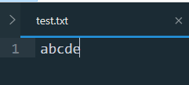

[TOC]

# 实用工具类

**注意：当数组元素或容器被持有对象是自定义数据类型时，当进行顺序比较操作时要求其实现`Comparable`接口，或提供比较器；当进行等价性（如：equals）比较操作时，要求重写正确的`equals`方法。** 

## Collections类

**提供了一系列静态方法，用于操作`Collection`接口的实现类。**

按方法名的字典序排列。

```java
int binarySearch(List<? extends Comparable<? super T>> list, T key) 	//在List中使用二分查找目标值key的索引，要求List被持有对象实现Comparable接口，且List必须已经升序排序。
int binarySearch(List<? extends T> list, T key, Comparator<? super T> c) //在List中使用二分查找目标值key的索引(比较时根据制定的比较器产生比较结果，若c为null则按被持有对象的自然顺序排序，此时要求元素实现Comparable接口根据compare方法比较)，要求必须已经升序排序。
void copy(List<? super T> dest, List<? extends T> src) 				//将所有元素从src列表复制到dest列表中  
void fill(List<? super T> list,T obj)							   //使用指定元素替换指定List中的所有元素，线性时间运行。
int	frequency(Collection<?> c, Object o) 							//返回指定 Collection 中等于指定对象的元素数。注意：通过被查找对象的equals方法进行相等比较。
T max(Collection<? extends T> coll) 								//根据其被持有对象的自然顺序返回给定Collection的最大元素。 
T max(Collection<? extends T> coll, Comparator<? super T> comp) 	  //根据指定比较器产生的顺序，返回给定 Collection 的最大元素。
T min(Collection<? extends T> coll) 								//根据其被持有对象的自然顺序返回给定Collection的最小元素。
T min(Collection<? extends T> coll, Comparator<? super T> comp) 	  //根据指定比较器产生的顺序，返回给定 Collection 的最小元素。
boolean replaceAll(List<T> list, T oldVal, T newVal) 				 //将指定List中的所有oldVal替换为newVal
void reverse(List<?> list) 										   //反转指定List中元素的顺序。
Comparator<T> reverseOrder() 									   //返回一个比较器，它产生与实现了Comparable接口对象自然顺序相反的排序效果
Comparator<T> reverseOrder(Comparator<T> cmp) 						//返回一个比较器，它产生与实现了与参数比较器相反的排序效果 
void sort(List<T extends Comparable<? super T> list) 			 	 //根据被持有对象的自然顺序对指定List按升序进行排序。要求被持有对象实现Comparable接口。
void sort(List<T> list, Comparator<? super T> c) 					//根据指定的比较器（若c为null则按被持有对象的自然顺序排序，此时要求元素实现Comparable接口根据compare方法比较）引起的顺序对指定的List进行排序。  
void swap(List<?> list, int i, int j) 								//交换指定List中指定位置的元素。 
```

**示例：对学生成绩信息的排序比较，查找**

```java

public class TestMain {

    //定义为静态类，为了能在main函数中直接调用
    static class Student {
        String name;
        float english, math, total;

        public Student(String n, float e, float m) {
            this.name = n;
            this.english = e;
            this.math = m;
            this.total = m + e;
        }
        /*
         * @Description TODO 重载toString方法输出个人成绩信息
         * @Date 11:52 2019/2/21
         **/

        @Override
        public String toString() {
            return "Name:" + name + "\ntotal:" +
                    total + "\nEnglish:" +
                    english + "\nMath:" + math+"\n";
        }

        /*
         * @Description TODO 重载equals方法，是为了二分查找时进行等价性比较
         * @Date 11:52 2019/2/21
         * @param null
         * @return : null
         **/

        @Override
        public boolean equals(Object obj) {
            Student oth=(Student)obj;   //强制类型转换
            return this.name.equals(oth.name)&&
                    this.english==oth.english&&
                    this.math==oth.math;
        }
    }
    /*
     * @Description TODO 自定以比较器，实现Student对象首先按总成绩从低到高排序，其次按名字排序（自小到大）。
     * @Date 11:38 2019/2/21
     **/

   static Comparator<Student> comparator = new Comparator<Student>() {
        @Override
        public int compare(Student o1, Student o2) {
            if (o1.total == o2.total) {
                return o1.name.compareTo(o2.name);
            }
            //乘以-1是为了总成绩的从低到高排序
            return Float.compare(o1.total, o2.total)*-1;
        }
    };

    public static void main(String[] args) {
        List<Student> students = new ArrayList<>();
        students.add(new Student("Tom", 75, 80));
        students.add(new Student("Tim", 85, 82));
        students.add(new Student("Bob", 95, 60));
        students.add(new Student("Alic", 63.5F, 88));
        students.add(new Student("Candy", 75, 80));

        System.out.println("after sorting:");
        //使用自定义比较器排序
        Collections.sort(students,comparator);
        for(Student stu:students){
            System.out.println(stu.toString());
        }
        System.out.print("The rank of Tom: ");
        System.out.println(Collections.binarySearch(students,new Student("Tom", 75, 80),comparator)+1);
    }
}
/*Output
after sorting:
Name:Tim
total:167.0
English:85.0
Math:82.0

Name:Bob
total:155.0
English:95.0
Math:60.0

Name:Candy
total:155.0
English:75.0
Math:80.0

Name:Tom
total:155.0
English:75.0
Math:80.0

Name:Alic
total:151.5
English:63.5
Math:88.0

The rank of Tom: 4
*/
```


## Arrays类

**提供一系列静态方法，支持对数组的操作。**

方法按字典序排序。`Arrays`重载了对不同数据类型（基本数据类型、自定义数据类型）的方法，为了减少篇幅，若没有特殊区别，用泛型参数（或`Object`）代替所有的数据类型；否则用`int`类型参数代表基本数据类型，用泛型参数（或`Object`）代表自定义数据类型。 

```java
List<T> asList(T... a) 								//返回一个ArrayList对象，并将所有参数添加到该ArrayList对象中。


//二分查找，Arrays重载了针对不同类型的二分查找算法。要求数组元素必须已经升序排序
int binarySearch(int[] a, int key) 					//返回：二分查找数组a中key所在的下标
int binarySearch(int[] a, int fromIndex, int toIndex, int key)  //返回：二分查找数组a下标范围[fromIndex,toIndex)中key所在的下标。
//针对自定义数据类型
int binarySearch(Object[] a, Object key) 			//返回：二分查找数组a中key所在的下标。要求a中元素实现Comparable接口
int binarySearch(Object[] a, int fromIndex, int toIndex, Object key)  //返回：二分查找数组a下标范围[fromIndex,toIndex)中key所在的下标。要求a中元素实现Comparable接口
int binarySearch(T[] a, T key, Comparator<? super T> c) //返回：二分查找数组a中key所在的下标。comparator指定比较方式，若c为null则根据元素的自然顺序比较（要求元素实现Comparable接口根据compare方法比较）。同样适用于基本数据类型（根据自动包装机制）
int binarySearch(T[] a, int fromIndex, int toIndex, T key, Comparator<? super T> c)  //返回：二分查找数组a下标范围[fromIndex,toIndex)中key所在的下标。comparator指定比较方式，若c为null则根据元素的自然顺序比较（要求元素实现Comparable接口根据compare方法比较）。同样适用于基本数据类型（根据自动包装机制）

    
//数组复制，Arrays提供了长度复制CopyOf和范围复制CopyOfRange，当原数组长度不足时会用null填充，对于byte,short,int,long,float,double类型用0填充。
T[]	copyOf(T[] original, int newLength) 			//复制指定的数组，截取或用 null 填充（如有必要），以使副本具有指定的长度。
T[]	copyOfRange(T[] original, int from, int to) 	//将指定数组的指定范围复制到一个新数组。

    
//等价性比较
boolean equals(Object[] a, Object[] a2) 		   //如果两个指定的数组对象彼此 完全相同(调用数组元素的equals方法)，则返回 true 。  


//数组填充，Arrays提供了全部填充和范围填充
void	fill(int[] a, int val) 					 //将指定的 int 值分配给指定 int 型数组的每个元素。
void	fill(int[] a, int fromIndex, int toIndex, int val) //将指定的 int 值分配给指定 int 型数组指定范围中的每个元素
void	fill(Object[] a, Object val) 			// 将指定的 Object 引用分配给指定 Object 数组的每个元素。
void	fill(Object[] a, int fromIndex, int toIndex, Object val) //将指定的 Object 引用分配给指定 Object 数组指定范围中的每个元素。

    
//数组排序，Arrays提供了全部排序和范围排序
void	sort(int[] a) 						//对指定的 int 型数组按数字升序进行排序。
void	sort(int[] a, int fromIndex, int toIndex) //对指定 int 型数组的指定范围按数字升序进行排序。
void	sort(Object[] a) 						//根据元素的自然顺序对指定对象数组按升序进行排序。要求数组元素实现Comparable接口
void	sort(Object[] a, int fromIndex, int toIndex) //根据元素的自然顺序对指定对象数组的指定范围按升序进行排序。要求数组元素实现Comparable接口
void	sort(T[] a, Comparator<? super T> c) 		// 根据指定比较器产生的顺序对指定对象数组进行排序。同样适用于基本数据类型（根据自动包装机制）
void	sort(T[] a, int fromIndex, int toIndex, Comparator<? super T> c) //根据指定比较器产生的顺序对指定对象数组的指定范围进行排序。同样适用于基本数据类型（根据自动包装机制）


//将数组全部做表达式操作
void setAll(T[] array, IntFunction<? extends T> generator)	//对数组每一项进行generator.apply(int i)操作。IntFunction是一个函数式接口
String	toString(Object[] a) 							//返回指定数组内容的字符串表示形式。
```

**示例：对数组的操作**

```java
public static void main(String[] args) {
        int arr[] = new int[]{4, 213, 1, 5, 3, 11, 35};
        int arr2[]= Arrays.copyOf(arr,arr.length);
        System.out.println("whether arr equals arr2 or not: "+Arrays.equals(arr,arr2));
        Arrays.sort(arr);
        //输出排序后arr数组内的内容
        System.out.println("after sorting arr: ");
        System.out.println(Arrays.toString(arr));

        System.out.println("show how to use setAll:");
        System.out.print("the init state of arr2:");
        System.out.println(Arrays.toString(arr2));
        System.out.print("let's double every term in the arr2:");
        Arrays.setAll(arr2, new IntUnaryOperator() {
            //匿名表达式实现接口对象
            @Override
            public int applyAsInt(int operand) {
                return arr2[operand]*2;
            }
        });
        System.out.println(Arrays.toString(arr2));
    }
```

## Math类

**`Math`类提供了一组静态方法支持基本数学函数的方法。**

```java
//两个常量
double	E  //底数 ，是所有自然数的底数。
double	PI //π  ，圆周率 。
```

```java
//常用方法，Java重载了对于多种基本数据类型的方法，为了减少篇幅，去除参数类型信息，由于Java隐式转换机制，因此即使参数类型未double，int，long的整数类型也可以。

abs(x)				//绝对值函数
//指数函数。返回值都是浮点数。
sqrt(x)				//计算平方根
cbrt(x)				//计算立方根
hypot(x,y)			//计算 (x的平方+y的平方)的平方根
exp(x)				//计算E^x值。
pow(x,y)			//计算x^y

//对数函数，返回浮点数
log10(x)			//以10为底x的对数
log(x)				//以E为底x的对数

//三角函数，
cos(x)				//余弦函数
acos(x)				//反余弦函数。返回的角度范围在 0.0 到 pi 之间。
sin(x)				//正弦函数
asin(x)				//反正弦函数。返回的角度范围在 -pi/2 到 pi/2 之间。
tan(x)				//正切函数
atan(x)				//反正切函数。返回的角度范围在 -pi/2 到 pi/2 之间。
toDegrees(double angrad)//将用弧度表示的角转换为近似相等的用角度表示的角。
toRadians(double angdeg)//将用角度表示的角转换为近似相等的用弧度表示的角。
//舍入函数，返回的都是浮点数
floor(x)			//下取整函数
ceil(x)				//上取整函数
rint(x)				//返回最接近参数的整数(转化为浮点数)，如果有2个数同样接近，则返回偶数的那个。

round(double x)		//返回对参数ｘ四舍五入后所得的整数近似值。参数是float返回int，参数是double返回long。
/*
1、参数的小数点后第一位<5，运算结果为参数整数部分。
2、参数的小数点后第一位>5，运算结果为参数整数部分绝对值+1，符号（即正负）不变。
3、参数的小数点后第一位=5，正数运算结果为整数部分+1，负数运算结果为整数部分。
*/


//最值函数
max(x,y)			//最大值函数
min(x,y)			//最小值函数


//随机数
random()			//返回一个随机值属于[0.0,1.0)
```

对数运算：

换底公式：$log_a^b=\frac{log_c^a}{log_c^b}$

$log_a^{(b\cdot c)}=log_a^b+log_a^c​$

$log_a^{\frac{b}{c}}=log_a^b-log_a^c$

$log_a^{b^c}=c\cdot log_a^b$

## BigInteger类

`BigInteger`是Java对大整数运算支持的封装类，`BigInteger`对象可以表示属于$[-2^{2147483647*32-1} ，2^{2147483647*32-1} -1]$ 的整数

`BigInteger` 提供所有 `Java` 的基本整数操作符的对应物，并提供 `java.lang.Math` 的所有相关方法。另外，`BigInteger` 还提供以下运算：模算术、GCD 计算、质数测试、素数生成、位操作以及一些其他操作。 

**常量**

```java
static BigInteger ONE 		//BigInteger常数1。  
static BigInteger TEN 		//BigInteger常数十。  
static BigInteger ZERO 		//BigInteger常数零。 
```

**构造函数**

```java
BigInteger(String val)				//将 BigInteger 的十进制字符串表示形式转换为 BigInteger。
BigInteger(String val, int radix)	 //将指定基数的 BigInteger 的字符串表示形式转换为 BigInteger。
```

**常用方法**

```java
//this指调用方法的BigInteger对象。
BigInteger add(BigInteger val)				 //返回其值为 (this + val) 的 BigInteger
BigInteger subtract(BigInteger val)			 //返回其值为 (this - val) 的 BigInteger。
BigInteger multiply(BigInteger val)			 //返回其值为 (this * val) 的 BigInteger
BigInteger divide(BigInteger val)			//返回其值为 (this / val) 的 BigInteger
BigInteger mod(BigInteger m)			    //返回其值为 (this mod m) 的 BigInteger。
BigInteger pow(int exponent)				//返回其值为 (thisexponent) 的 BigInteger
BigInteger modPow(BigInteger exponent, BigInteger m)	//返回其值为 (this^exponent mod m) 的 BigInteger。
BigInteger negate()					  	 	//返回其值是 (-this) 的 BigInteger
BigInteger abs( )						   //返回其值是此 BigInteger 的绝对值的 BigInteger。
BigInteger gcd(BigInteger val)				//返回一个 BigInteger，其值是 abs(this) 和 abs(val) 的最大公约数。
BigInteger and(BigInteger val)				//返回其值为 (this & val) 的 BigInteger。还有or、not、xor、shiftLeft、shiftRight等位操作	
int compareTo(BigInteger val)				//将此 this与val 进行比较。this < val返回-1，this==val返回0,this>val返回1
boolean equals(BigInteger val)				//判断this是否与val相等	
BigInteger max(BigInteger val) 				//返回此this与val。较大的一个
BigInteger min(BigInteger val) 				//返回此this与val。较小的一个 
double 	doubleValue()					   //将此 BigInteger 转换为 double。还有intValue、longValue、floatValue	
String toString()						  //返回此 BigInteger 的十进制字符串表示形式。
String toString(int radix)	   			   //返回此 BigInteger 的给定基数的字符串表示形式。radix
byte[] toByteArray() 					  //返回一个包含此BigInteger的二进制补码表示的字节数组。 
BigInteger nextProbablePrime()   			//返回一个大于this的BigInteger，它是合数的概率不超过2的负100次方
BigInteger probablePrime(int bitLength, Random rnd) 	//返回一个指定二进制长度的正数BigInteger，它是合数的概率不超过2的负100次方，rnd是一个Random对象
```

## Random类

`Random`提供了产生伪随机数的方法，常用于随机算法和一些程序测试。

`Random`类产生随机数的算法是一种伪随机算法，在进行产生随机数时，随机算法通过起源数字（`seed`）或叫种子数进行一系列的变换，产生随机数。**所以相同种子数在相同次数产生的随机数是相同的。**

**构造方法**

```java
public Random()				//该构造方法会使用系统当前时间的相关数字作为产生随机数的种子数并利用该种子数产生随机数；
public Random(long seed)	//设置种子
```


```java
public boolean nextBoolean()
//生成一个随机的boolean值，生成true和false的值几率相等

public double nextDouble()
//生成一个随机的double值，数值介于[0,1.0)之间。

public double nextFloat()
//生成一个随机的Float值，数值介于[0,1.0)之间。

public int nextInt()
//生成一个随机的int值，该值介于int的区间，也就是-2^31到2^31-1之间。

public int nextInt(int n)
//生成一个随机的int值，该值介于[0,n)的区间，也就是0到n之间的随机int值，包含0而不包含n。

public int nextLon()
//生成一个随机的long值，该值介于long的区间，也就是-2^63到2^63-1之间。

public void setSeed(long seed)
//重新设置Random对象中的种子数。设置完种子数以后的Random对象和相同种子数使用new关键字创建出的Random对象相同。
```

## Scanner类

`Scanner`类提供了实用的从输入流`InputStream`读取格式数据的方法，很基础很有用。

输入流就是提供数据的数据源，标准输入流`System.in`指的就是键盘。

**构造方法**

```java
Scanner(InputStream source) 		//构造一个新的 Scanner ，产生从指定输入流读取的值。
Scanner(File source) 				//构造一个新的 Scanner ，产生从指定文件读取的值。
Scanner(String source) 				//构造一个新的 Scanner ，产生从指定字符串读取的值。
```

**常用方法**

Scanner输入时默认分割符是空格。

当从输入流读入数据时，由于输入数据是源源不断的，而我们需要的数据可以看作是一段一段的，由`delimiter`进行划分，`Scanner`默认分割符`delimiter`是空格，可以通过`useDelimitter()`设置分隔符。

```java
void close()							//关闭Scanner
boolean hasNext()						//判断输入流当前位置后，是否还有下一段输入，读取停止时等待读取
boolean hasNext(String regex)			 //如果输入流当前位置后下一字符串与正则表达式regex匹配，返回true
boolean hasNextBigInteger()				//判断是否有下一个BigInteger读入
boolean hasNextBoolean()
boolean hasNextByte()
boolean hasNextDouble()
boolean hasNextInt()
boolean hasNextLine()					//判断输入流当前位置后，是否还有下一段输入，读取停止时跳出读取
boolean hasNextLong()
boolean hasNextShort()

String next()							//返回读取的字符串
String nextLine()  						//返回读取的字符串
BigInteger nextBigInteger()				 //返回下一个BigInteger
boolean nextBoolean()  
byte nextByte()  
double nextDouble()  
float nextFloat()  
int nextInt()  
long nextLong() 
short nextShort()  

Scanner useDelimiter(String pattern) 	//将此Scanner的分隔模式设置指定pattern
```

**停止输入**

有时我们会遇到从键盘（`System.in`）循环读入的情况，读入到某个截至标志或是直到输入流结束。这个时候我们会使用while循环读入：

```java
Scanner cin=new Scanner("This is an InputStream!");
while(cin.hasNext())					//错误方式，无法跳出循环

//方式1
while(cin.hasNextLine()){
    //...
}
//方式2
while(cin.hasNext("!")){
    //...
}
```

当使用`while(cin.hasNext())`时到达输入流末尾后，它不会跳出循环而是继续等待输入，因此不能用。

方式1，会在到达输入流末尾后跳出循环。

方式2的`hasNext(String regex)`会在读入到与正则表达式`pattern`相匹配的是否返回`true`，因此也可以跳出循环。关于正则表达式的内容，可以参考字符串部分里有关正则表达式的内容。

**注意：当我们的输入源（输入流）是文件或是字符串的时候，`hasNext()`，`hasNextLine()`都可以正确判别输入流的结束从而退出循环。**

**next与nextLine的区别**

next与nextLine都可以获取一段字符串，二者区别如下：

next方法:

- 一定要读取到有效字符后才可以结束输入。
- 对输入有效字符之前遇到的空白，`next()` 方法会自动将其去掉。
- 只有输入有效字符后才将其后面输入的空白作为分隔符或者结束符。
- `next()` 不能得到带有空格的字符串。

```java
public static void main(String[] args) {
        Scanner cin=new Scanner(System.in);
        while(!cin.hasNext("#")){
            System.out.println(cin.next());
        }
    }
    /*Input:This is a test #
    Output:
    This
	is
	a
	test
	*/
```

nextLine方法

- 以`Enter`为结束符,也就是说 `nextLine()`方法返回的是输入回车之前的所有字符；
- **字符串可以包含空格。**

```java
public static void main(String[] args)  {
        Scanner cin = new Scanner(System.in);
        while (!cin.hasNext("!")) {
            System.out.println(cin.nextLine());
        }
    }
   /*Input:
   first line    end
   second line   end
   !
   
   Output:
   first line    end
   second line   end
   */
   
```

设置分隔符，当读取格式化数据是，`Scanner`采用的默认分隔符`delimiter`是空格（`nextLine`、`hasNextLine`除外），可以通过`useDelimitter()`设置分隔符。

```java
public static void main(String[] args)  {
        Scanner cin = new Scanner(System.in);
        cin.useDelimiter(",");
        while(cin.hasNextInt()){
            System.out.println(cin.nextInt());
        }
    }
    /*Input：102030
    Output:
    1
	2
	3
	*/
```

## System.out

`System.out`是一个静态输出流对象，我们可以通过它将字符串输出到控制台中。

**常用方法**

```
System.out.print(String str)  //打印str
System.out.println(String str)  //打印str并在末尾追加换行
System.out.printf(String format,Object ... args)  //和C语言的printf函数一样，支持格式字符串
```

**重定向**

Scanner 可以传入一个File对象读取文件内容，我们还可以通过对`System.out`重定向使得可以向文件中输出内容。

```java
System.setOut(PrintStream)
```

```java
public static void main(String[] args) throws FileNotFoundException {
        Scanner cin = new Scanner(System.in);
        System.setOut(new PrintStream("./test.txt"));//写入根目录下的test.txt文件
        while(!cin.hasNext("End")){
            System.out.print(cin.next());
        }
    }
/*Output:
a b c d e
End
*/
```

**结果**

